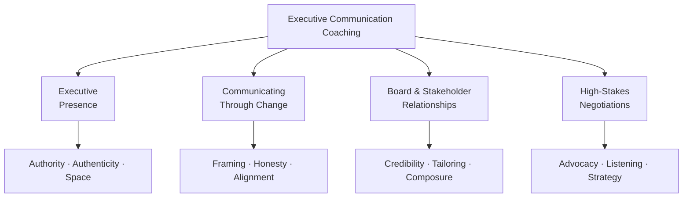

At the senior leadership level, communication is not just a skill — it is how you exercise influence, build trust, and move organizations forward. Eloqaura's Executive Communication Coaching delivers precision guidance tailored to the demands of top-tier leadership, helping you refine your presence, articulate your vision, and navigate the high-stakes situations that define executive performance.

## The coaching methodology

Eloqaura's executive coaching is individualized and grounded in the psychology of connection. Your coach works closely with you to understand your current communication style, the specific contexts you operate in, and the outcomes you need to achieve. Sessions focus not just on skill-building, but on the deeper mindset shifts that make lasting change possible.

Coaching addresses how you present yourself in formal settings, how you communicate during periods of uncertainty or change, how you build alignment with boards and stakeholders, and how you perform when the stakes are highest.

## What you can expect to achieve

Through this coaching, you will develop a stronger, more consistent executive presence — the quality that makes people trust your leadership instinctively. You will sharpen your ability to communicate strategy in ways that inspire confidence and motivate action. And you will gain the composure and clarity to perform at your best in the moments that matter most.

> "The executive coaching gave me the tools to navigate a complex merger. I learned to articulate my vision in a way that inspired confidence."
>
> — Michael Ross, CEO, Horizon Structures

## Coaching focus areas

## Common coaching topics

<AccordionGroup>
  <Accordion title="Developing executive presence">
    Explore the habits, language, and physical signals that project authority and authenticity. Learn to occupy space — in a room, in a conversation, and in your organization — in a way that commands respect and invites trust.
  </Accordion>
  <Accordion title="Communicating through change">
    Develop the skills to lead people through uncertainty with honesty and confidence. Learn how to frame difficult messages, hold space for questions and concerns, and keep your team aligned when the path forward is not fully clear.
  </Accordion>
  <Accordion title="Navigating board and stakeholder relationships">
    Refine how you communicate with boards, investors, and senior stakeholders. Work on tailoring your message for different audiences, building credibility over time, and handling challenging questions with composure and precision.
  </Accordion>
  <Accordion title="High-stakes negotiations">
    Strengthen your ability to advocate clearly and persuasively in high-pressure negotiations. Develop the presence and strategic communication style that allows you to hold your position, listen actively, and find outcomes that serve your organization.
  </Accordion>
</AccordionGroup>

Ready to elevate your leadership communication? Visit the [Executive Communication Coaching page](https://www.eloqaura.com/programs-and-services/executive-communication-coaching) to learn more and begin.
