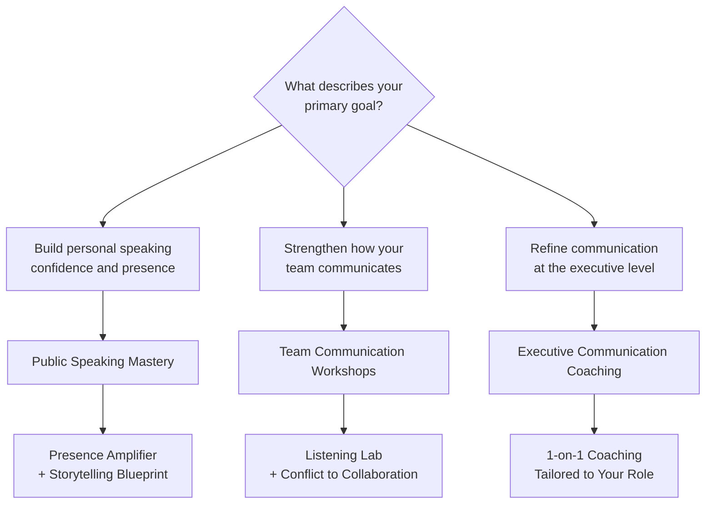

Eloqaura offers three distinct program tracks, each rooted in the psychology of connection. Whether you want to speak with confidence in front of a crowd, strengthen how your team works together, or sharpen the communication skills that define senior leadership, there is a track built for where you are — and where you want to go.

## The three tracks

**Public Speaking Mastery** is designed for individuals who want to become more confident, compelling speakers. If you are an individual contributor, a mid-level professional, or anyone who needs to present ideas clearly and persuasively, this track gives you the tools to command a room.

**Team Communication Workshops** are built for team leads, managers, and the teams they oversee. These sessions focus on building psychological safety, improving how people listen to one another, and turning conflict into genuine collaboration.

**Executive Communication Coaching** provides precision guidance for senior leaders and executives. If you are navigating high-stakes decisions, leading through change, or refining the presence and style that top-tier leadership demands, this track delivers individualized coaching at the level your role requires.

## Which track is right for you?

<Note>
Not sure which track fits your situation? Start with the program that matches your most pressing communication challenge. Many participants find that beginning with Public Speaking Mastery or a Team Workshop opens the door to deeper work through Executive Coaching later.
</Note>
