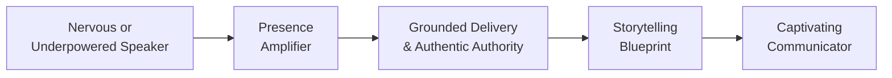

Great speakers are not born — they are trained. Eloqaura's Public Speaking Mastery programs give you a structured path from nervous presenter to captivating orator. This page covers the two core programs in this track: Presence Amplifier and Storytelling Blueprint.

## Presence Amplifier

Presence is the quality that makes people lean in when you speak. The Presence Amplifier program helps you develop the physical, vocal, and psychological habits that project authority and authenticity in any setting — from a small team meeting to a large conference stage.

**Who it's for:** Professionals at any level who feel their delivery does not match the quality of their ideas. This program is especially valuable if you tend to minimize yourself, rush through material, or struggle to hold a room's attention.

**What you'll gain:** You'll leave with a stronger, more grounded delivery style, techniques for managing nerves in real time, and a clearer sense of the physical presence you project when you speak.

## Storytelling Blueprint

Facts inform, but stories move people to act. The Storytelling Blueprint program teaches you how to structure and deliver narratives that resonate — whether you are pitching a proposal, presenting results, or motivating a team.

**Who it's for:** Anyone who needs to persuade, inspire, or create a memorable impression. This program suits both emerging professionals building their communication toolkit and experienced speakers who want to add depth and narrative power to their existing style.

**What you'll gain:** You'll develop a repeatable framework for crafting compelling stories, learn how to adapt your narrative for different audiences, and practice delivering with the kind of conviction that drives action.

## Your development path

<CardGroup cols={2}>
  <Card title="Presence Amplifier" icon="microphone">
    Build the physical and psychological habits that project authority and hold a room's attention from the moment you begin speaking.
  </Card>
  <Card title="Storytelling Blueprint" icon="book-open">
    Master the structure and delivery of compelling narratives that persuade audiences, inspire action, and make your message unforgettable.
  </Card>
</CardGroup>

<Tip>
Storytelling and presence reinforce each other. Once you have a compelling story to tell, your presence gives it the weight it deserves. Consider working through Presence Amplifier before or alongside Storytelling Blueprint for the most complete transformation.
</Tip>

Ready to take the next step? Visit the [Public Speaking Mastery program page](https://www.eloqaura.com/programs-and-services/public-speaking-mastery) to learn more and enroll.
